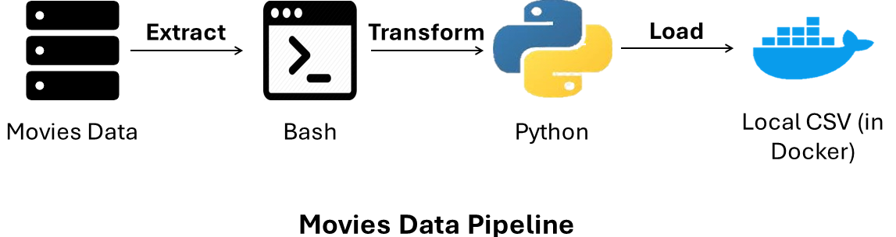
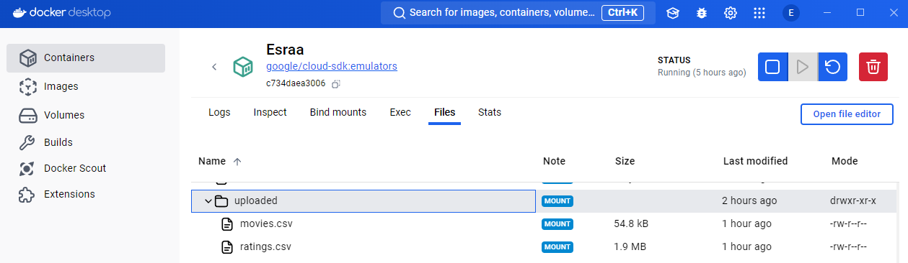

# Movies Data ETL using Docker

The goal of this ETL process is to extract movie ratings data, process it, and store it in a local storage setup using Docker. This project simulates the ETL process without relying on cloud services, making it suitable for local or on-premise environments.

## Project Architecture



## Steps

1. **Download ratings and movies data**: Use the provided bash script to download the dataset from [MovieLens](https://files.grouplens.org/datasets/movielens).

2. **Process the Data and Export to CSV**:
    - The Python scripts process the raw data, transform it into the desired format, and save it locally.

3. **Run the Docker Container**:
    - The entire ETL process is encapsulated within a Docker container for easy setup and portability.
    - Build the Docker image:
      ```bash
      docker build -t movies_data_etl .
      ```
    - Run the ETL process inside the Docker container:
      ```bash
      docker run --rm movies_data_etl
      ```

## Pre-requisites

- **Docker**: Ensure Docker is installed and running on your machine.
- **Python 3.x**: Required to run the Python scripts if not using Docker.

## Applying The ETL Process


## Applying The ETL Process

**Download Data:**  
Use the following command to download the dataset:

    bash download_data.sh

**Run the ETL Process:**  
To process the data, use the following command:

    python movies_etl.py


After running the ETL process, the `uploaded` folder within the Docker container contains the processed `movies.csv` and `ratings.csv` files.



**Note:** The `uploaded` folder within the Docker container is mounted to ensure the processed files are accessible outside the container.

## Pre-requisites

- **Docker**: Ensure Docker is installed and running on your machine.
- **Python 3.x**: Required to run the Python scripts if not using Docker.

## Troubleshooting

- **File Paths or Mounting Issues:**
  - Ensure the paths in your Docker configuration are correct.
  - Verify that the `uploaded` folder is correctly mounted and accessible.

- **Script Execution Issues:**
  - Check that all dependencies are installed.
  - Ensure that the scripts have the necessary permissions to execute.

## License

This project is licensed under the MIT License - see the [LICENSE](LICENSE) file for details.

